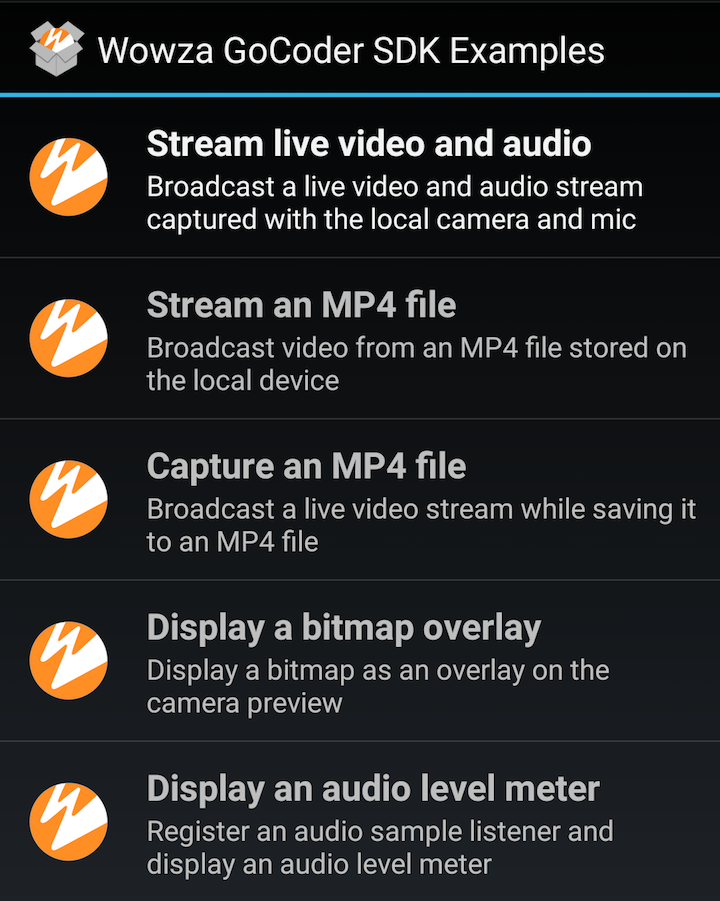

# Wowza GoCoder SDK for Android Sample App
This repository contains a sample application that demonstrates the capabilities of the [Wowza GoCoder™ SDK for Android](https://www.wowza.com/products/gocoder/sdk).

## Development Requirements

Android SDK 4.4.2 or later

Android Studio 1.2.0 or later

## Sample App Activities
When you first run the sample app, it displays a list of activities that demonstrate the features of the GoCoder SDK.

| Title | Activity Class | Description |
| --- | --- | --- |
|**Stream live video and audio** | `CameraActivity.java` |This activity demonstrates the primary camera, audio, and live streaming capabilities of the GoCoder SDK. |
| **Stream an MP4 file** | `MP4BroadcastActivity.java` |This activity demonstrates how to broadcast the frames from a local MP4 file using the **WZBroadcast**, **WZBroadcastComponent**, and related classes and interfaces, which provide lower-level access to the various components involved in a Wowza streaming broadcast. |
| **Capture an MP4 file** | `MP4CaptureActivity.java` |This activity saves the video from the camera to an MP4 file on the device's local storage as it's streamed. |

## More resources
[Wowza GoCoder Software Development Kit](https://www.wowza.com/products/gocoder/sdk)

[Wowza GoCoder SDK Developer Documentation](https://www.wowza.com/resources/gocodersdk/docs/1.0/)

[Wowza GoCoder SDK for Android API Refernence](https://www.wowza.com/resources/gocodersdk/docs/1.0/api-reference-android/)

[Wowza GoCoder SDK for Android Release Notes](https://www.wowza.com/resources/gocodersdk/docs/1.0/release-notes-android/)

Wowza Media Systems™ provides developers with a platform to create streaming applications and solutions. See [Wowza Developer Tools](https://www.wowza.com/resources/developers) to learn more about our APIs and SDK.

## Contact
[Wowza Media Systems, LLC](https://www.wowza.com/contact)

## License
This code is distributed under the [BSD 3-Clause License](https://github.com/WowzaMediaSystems/gocoder-sdk-samples-android/blob/master/LICENSE.txt).
